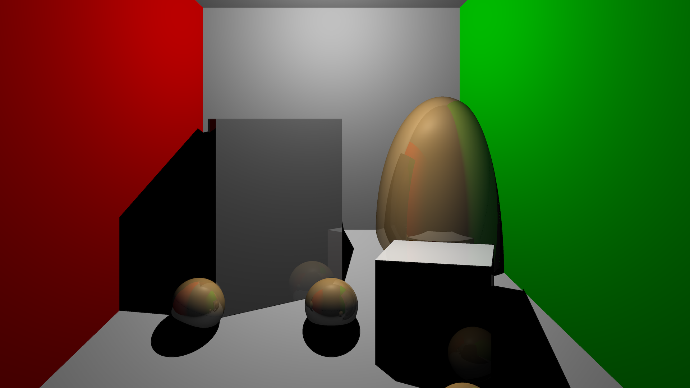

# Raytracer

A basic raytracer originally developed for UC San Diego CSE167/CSE168 Computer Graphics courses. Features include Blinn-Phong shading, shadows, and reflections, bounding volume hierarchy and path tracing.

# Build

Requires C++23 compiler (e.g., Clang 17+) and [GLM](https://github.com/g-truc/glm) library.

    mkdir build && cd build
    cmake -DCMAKE_BUILD_TYPE=Release ..
    make
    ./raytracer ../scenes/scene1.test

