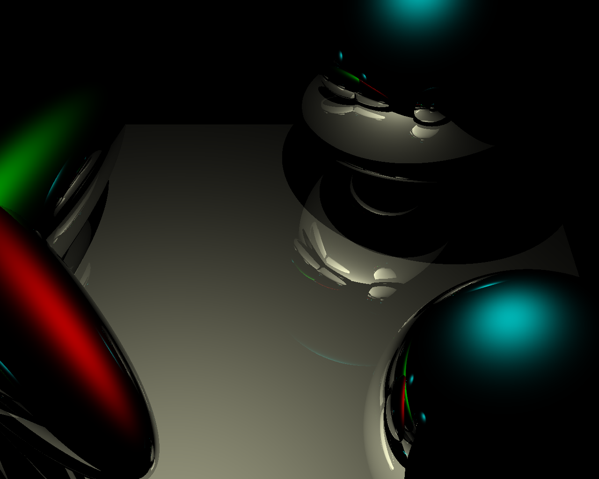

# Raytracer

A basic raytracer originally developed for UC San Diego CSE167x Computer Graphics [Homework 3](https://learning.edx.org/course/course-v1:UCSanDiegoX+CSE167x+2T2018/block-v1:UCSanDiegoX+CSE167x+2T2018+type@sequential+block@Homework_3). Features include Blinn-Phong shading, shadows, and reflections.

# Build

Requires C++23 compiler (e.g., Clang 17+) and [GLM](https://github.com/g-truc/glm) library.

    mkdir build && cd build
    cmake -DCMAKE_BUILD_TYPE=Release ..
    make
    ./raytracer ../scenes/scene1.test

