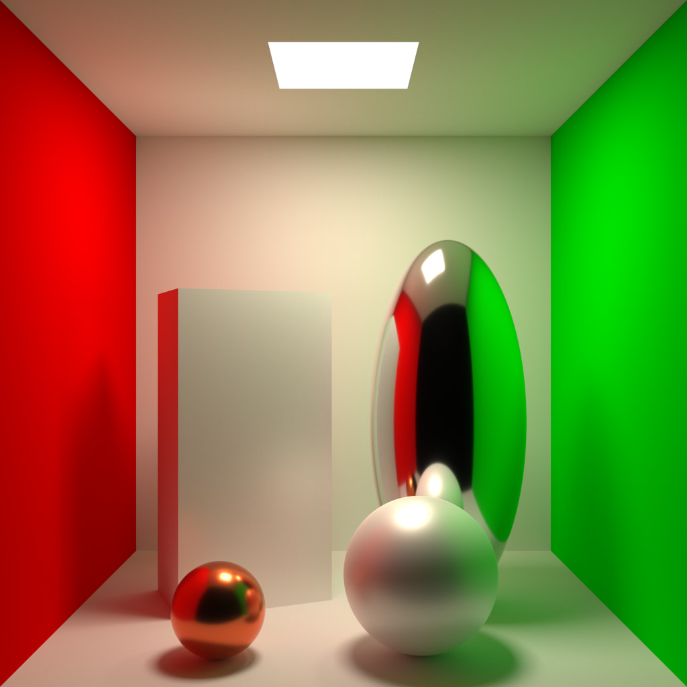
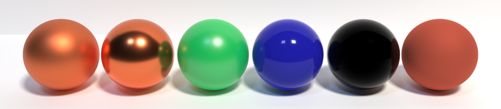
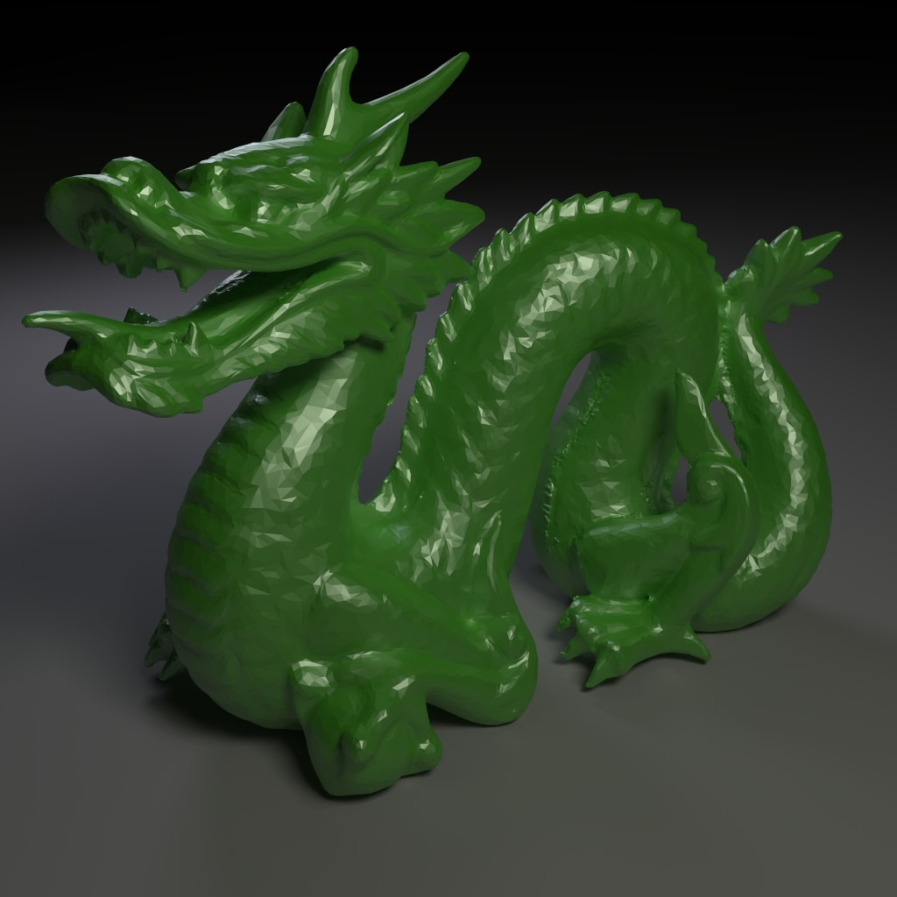

# Raytracer

A CPU ray/path tracer with Whitted, direct-lighting, and path-tracing integrators, originally developed for UC San Diego's CSE167/CSE168 computer graphics courses. Features include Phong and GGX shading, a bounding volume hierarchy, next event estimation, Russian roulette, and importance sampling.

# Build

Requires C++23 compiler (e.g., Clang 17+) and [GLM](https://github.com/g-truc/glm) library.

    mkdir build && cd build
    cmake -DCMAKE_BUILD_TYPE=Release ..
    make
    ./raytracer ../scenes/cornell.test

# Scenes

